# 🛒 MiniCommerce — Production-Grade Backend Engineering, Cloud Architecture & System Design Laboratory


**MiniCommerce** is an evolving, production-grade backend engineering, cloud architecture, and system design laboratory built across **10 iterative versions** — from a bare FastAPI CRUD app to a fully observable, cloud-deployed, chaos-tested enterprise platform.

It serves as a benchmark laboratory for exploring **Infrastructure as Code (Terraform)**, **AWS Cloud Architecture (VPC, ECS Fargate, RDS PostgreSQL Multi-AZ, ElastiCache Redis, ALB, WAF)**, **Amazon Managed Prometheus (AMP) & Amazon Managed Grafana (AMG)**, **Prometheus Telemetry & Grafana SRE Dashboards**, **OpenTelemetry Distributed Tracing**, **Database Read-Replica Connection Splitting**, **Locust Concurrency & Chaos Stress Testing**, **high-throughput backend patterns**, **database optimization**, **pessimistic concurrency control**, **in-memory distributed caching**, **asynchronous task offloading**, **sliding-window rate limiting**, **zero-trust dual-token rotation**, **distributed resilience patterns**, **automated CI/CD pipelines**, and **cloud container delivery**.

---

## 📑 Table of Contents

- [📺 Video Walkthrough & Playlist](#-video-walkthrough--playlist)
- [🌐 Live Deployment (AWS EC2)](#-live-deployment-aws-ec2)
- [🏗️ System Architecture](#️-system-architecture)
- [🚀 Key System Features (V10 Current State)](#-key-system-features-v10-current-state)
- [📊 Benchmark Suite & Performance Milestones](#-benchmark-suite--performance-milestones)
- [🏗️ 5-Tier Data Layer Architecture](#️-5-tier-data-layer-architecture)
- [🗺️ System Design Journey Across 10 Versions](#️-system-design-journey-across-10-versions)
- [📂 Project Structure](#-project-structure)
- [⚡ Execution Guide: Docker & Local Replication](#-execution-guide-docker--local-replication-v10)
- [📸 AWS Cloud Infrastructure Evidence](#-aws-cloud-infrastructure-evidence)
- [📝 Technical Documentation Suite](#-technical-documentation-suite)
- [📁 Version Work Logs (v/ Directory)](#-version-work-logs-v-directory)

---

## 📺 Video Walkthrough & Playlist

[](https://www.youtube.com/playlist?list=PLfO2FP2kMQYo)

> 💡 **Watch the 3-minute Master Architecture Overview**, or explore the **10 version-by-version technical runbook videos** in the right-side playlist sidebar.

| # | Version | Video Title | Link |
|---|---------|-------------|------|
| 🎬 | **Overview** | **MiniCommerce — Full System Architecture Overview** | [](https://youtu.be/CMOk4c3myBI) |
| 1 | V1 | Foundation & API Architecture | [](https://youtu.be/EYgWDUlEJv4) |
| 2 | V2 | Database Engineering & High-Concurrency | [](https://youtu.be/yJnGCeIrUKw) |
| 3 | V3 | Containerization & Distributed Caching | [](https://youtu.be/CvW56mzBd8c) |
| 4 | V4 | Async Task Queue & Rate Limiting | [](https://youtu.be/05Wom1Iac2k) |
| 5 | V5 | Enterprise Security & Distributed Resilience | [](https://youtu.be/QWhE8NKK8qw) |
| 6 | V6 | DevOps Automation & CI/CD Pipelines | [](https://youtu.be/4HGJ2PiaI1s) |
| 7 | V7 | Infrastructure as Code & AWS Cloud | [](https://youtu.be/ot3zL4YatW4) |
| 8 | V8 | Enterprise Observability & SRE | [](https://youtu.be/nRODS6saJIw) |
| 9 | V9 | High Availability & Chaos Engineering | [](https://youtu.be/BfkE8X-X6ik) |
| 10 | V10 | Production Readiness & Gap Resolution | [](https://youtu.be/rHje_w3OsV0) |

---

## 🌐 Live Deployment (AWS EC2)

> **MiniCommerce is deployed on a single AWS EC2 instance** (`c7i-flex.large`, Ubuntu 24.04 LTS) running 6 Docker Compose containers with **409,811+ seeded records** (10,000 Users, 50,000 Products, 100,000 Orders, 249,811 Order Items).

| Service | Live URL | Credentials |
|---------|----------|-------------|
| 🛒 **React Storefront SPA** | [http://13.233.74.197:3000](http://13.233.74.197:3000) | See accounts below |
| ⚡ **FastAPI Swagger Docs** | [http://13.233.74.197:3000/docs](http://13.233.74.197:3000/docs) | Bearer JWT Token |
| 📊 **Grafana SRE Dashboards** | [http://13.233.74.197:3001](http://13.233.74.197:3001) | `admin` / `admin` |
| 📈 **Prometheus Metrics** | [http://13.233.74.197:9090](http://13.233.74.197:9090) | None |
| 🔍 **Jaeger Distributed Tracing** | [http://13.233.74.197:16686](http://13.233.74.197:16686) | None |
| 💚 **Liveness Probe** | [http://13.233.74.197:3000/healthz](http://13.233.74.197:3000/healthz) | None |

**Demo Accounts:**
- **SRE Admin**: `admin@minicommerce.com` / `Admin@123456`
- **Customer (Alice)**: `alice@example.com` / `Password123!`
- **Customer (Bob)**: `bob@example.com` / `Password123!`

> 📋 Full EC2 deployment guide, SSH access, and seeding instructions: [`EC2_deployed.md`](EC2_deployed.md)

---

## 🏗️ System Architecture

<p align="center">
  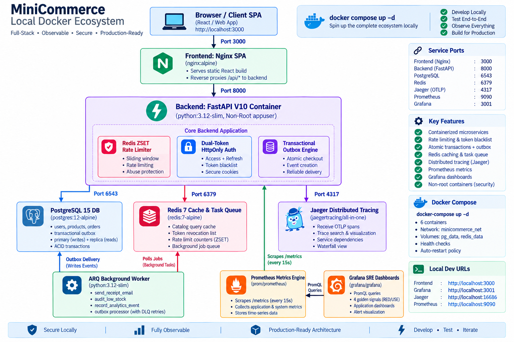
</p>

<p align="center"><em>MiniCommerce V10 — Complete Local Docker Ecosystem Architecture (8 containers, full observability stack)</em></p>

---

## 🚀 Key System Features (V10 Current State)

### 🔀 Database Read-Replica Connection Splitting (`get_read_db`)
Dual SQLAlchemy async engines (`primary_engine` for mutations and `replica_engine` for read queries) offloading catalog browsing and revenue analytics queries to read replicas with automatic primary fallback.

### 🧪 Locust High-Concurrency Load & Resilience Stress Suite (`locustfile.py` & `run_chaos_test.py`)
Scriptable load generator simulating 1,000+ unique authenticated virtual users (with distinct UUIDs and JWT tokens) executing catalog search, cart operations, and idempotent checkouts.

### 🛡️ AWS WAF (Web Application Firewall) & Security Hardening Module
Terraform HCL module (`terraform/modules/waf/`) attaching a regional Web ACL to the Application Load Balancer with SQLi, XSS, payload inspection, and 1,000 req/5m IP rate limiting.

### 🌋 Disaster Recovery & Chaos Engineering Runbook (`docs/v9/chaos-and-dr.md`)
Complete SRE operational runbook documenting RTO < 30s, RPO = 0s (guaranteed by Transactional Outbox pattern), and failure injection procedures.

### 📊 Prometheus Telemetry Engine & Exporter (`/metrics`)
Exposes standard Prometheus metrics format on `GET /metrics` via `prometheus-fastapi-instrumentator` with custom SRE metrics (`http_requests_total`, `http_request_duration_seconds`, `db_pool_connections_active`, `redis_cache_hits_total`, `redis_cache_misses_total`, `circuit_breaker_state`, `outbox_events_pending_total`, `outbox_events_dlq_total`).

### 📈 Pre-Built Grafana SRE Dashboards
Auto-provisioned Grafana dashboards (`golden_signals.json` for p50/p95/p99 Latency, RPS by route, Error % gauge, Saturation; `database_and_cache.json` for DB connection pool utilization, Redis hit rate %, Circuit Breakers timeline, Outbox DLQ).

### 🚨 SRE Alertmanager Rules (`alerts.yml`)
Automated alert rules (`HighFiveHundredErrorRate`, `CircuitBreakerOpen`, `OutboxDLQBacklog`, `HighLatencyP95`) evaluating operational thresholds every 15 seconds.

### 🔍 OpenTelemetry & Jaeger Distributed Tracing
OTLP trace span exporter tracking distributed request propagation across Nginx ➔ FastAPI ➔ PostgreSQL ➔ Redis ➔ ARQ Worker.

### ☁️ Amazon Managed Prometheus (AMP) & Grafana (AMG) via Terraform
Reusable HCL module in `terraform/modules/observability/` provisioning `aws_prometheus_workspace`, `aws_grafana_workspace`, and IAM `aps:RemoteWrite` task execution policies.

### 🧪 49-Test Automated Pytest Suite
100% passing test coverage including `backend/tests/test_telemetry.py` asserting `/metrics` HTTP 200 exposition, counter increments, and circuit breaker state tracking.

### 🏗️ Infrastructure as Code (IaC) via Terraform
7 production-grade reusable HCL modules in `terraform/modules/` (`vpc`, `rds`, `elasticache`, `alb`, `ecs`, `iam_and_secrets`, `observability`) provisioning AWS cloud resources with zero manual click-ops.

### 🌐 Dual-AZ VPC Network Topology
Multi-AZ VPC across `us-east-1a` and `us-east-1b` with Public Subnets (ALB, Fargate Tasks), Private App Subnets, and Private Database Subnets (RDS, ElastiCache Redis).

### ⚖️ AWS Application Load Balancer (ALB)
High-availability internet-facing ALB routing traffic dynamically via path rules (`/api/*` ➔ Backend Target Group port 8000, `/*` ➔ Frontend Target Group port 80).

### 🚢 AWS ECS Fargate Container Orchestration
Serverless container execution for `backend` (FastAPI), `worker` (ARQ Background Task Processor), and `frontend` (Nginx React SPA) with auto-scaling security groups and CloudWatch logging streams.

### 🐘 AWS RDS PostgreSQL 15 Engine
Multi-AZ capable database tier running in isolated Private DB subnets with automated daily backups and KMS storage encryption.

### ⚡ AWS ElastiCache Redis Replication Cluster
High-speed in-memory cache and ARQ task queue cluster running in Private DB subnets with At-Rest & Transit (TLS) Encryption.

### 🔐 AWS Secrets Manager Integration
Dynamic retrieval of database credentials, Redis AUTH tokens, and JWT signing keys via boto3 runtime fetching (`app/core/cloud_secrets.py`).

### 🌱 Automated 1-Shot Database Seeding
Automated Fargate 1-shot task execution (`python app/db/seed.py`) seeding admin accounts, users, hardware catalog, and simulated orders directly into live AWS RDS PostgreSQL.

### 🛠️ Automated Git Pre-Commit Quality Hooks
`.pre-commit-config.yaml` executing `ruff`, `ruff-format`, and `detect-secrets` leak scanning before git commits.

### ⚙️ Centralized Tooling Configuration (`pyproject.toml`)
Unified quality rules for Ruff, Mypy type-checking, Pytest, and Coverage report generation (`coverage.xml`).

### 🔄 GitHub Actions CI Pipeline (`ci.yml`)
Automated Pull Request and `main`/`develop` branch quality gates executing Ruff linting, Mypy static type checking, Bandit AST security scanning, Trivy vulnerability checks, and Pytest with `postgres:15-alpine` and `redis:7-alpine` service containers with 75% coverage enforcement.

### 📦 GitHub Actions CD Container Pipeline (`cd.yml`)
Automated Docker BuildKit multi-stage container builds pushing `backend`, `worker`, and `frontend` images directly to GitHub Container Registry (`ghcr.io`).

### 🔐 Dual-Token Zero-Trust Security
Short-lived Access Tokens (15 min) in `Authorization: Bearer` headers + Long-lived Refresh Tokens (7 days) in `HttpOnly`, `SameSite=Lax` cookies. Automatic token rotation via `POST /api/v1/auth/refresh`.

### 🚫 Redis Token Revocation List (`TokenBlacklistService`)
Instant JWT revocation on logout (`POST /api/v1/auth/logout`) or token rotation. `deps.get_current_user` rejects revoked tokens with `401 Unauthorized`.

### 🛡️ Scoped Role-Based Access Control (RBAC)
Fine-grained roles (`CUSTOMER`, `STORE_MANAGER`, `SRE_ADMIN`) mapped to explicit permission scope lists (`products:read`, `products:write`, `products:delete`, `orders:create`, `admin:telemetry`).

### ⚡ Thread-Safe Circuit Breaker State Machine
Isolates downstream datastore failures (`CLOSED` ➔ `OPEN` ➔ `HALF-OPEN`) when error rates exceed 50% over a 10s sliding window.

### 📦 Transactional Outbox Pattern Engine
Inserts `outbox` event records inside the **exact same atomic SQL transaction** (`db.commit()`) as order checkouts. ARQ worker polls outbox events to guarantee 100% reliable side-effect processing.

### 🛑 Graceful Shutdown Handling
FastAPI lifespan context intercepts SIGTERM/SIGINT signals to drain database connection pools (`await engine.dispose()`) and close Redis pools cleanly before shutdown.

### 📊 Health Probe Separation
Separates `/healthz/liveness` (process liveness check) and `/healthz/readiness` (PostgreSQL + Redis downstream ping check returning `503 Service Unavailable` on store outages).

### ⏩ Keyset (Cursor-Based) Pagination
Constant `O(1)` query execution via `GET /api/v1/products/keyset` (`WHERE id > :last_seen_id AND is_deleted = FALSE ORDER BY id ASC LIMIT :limit`), bypassing deep `OFFSET` buffer scan overheads.

### 🗑️ Soft Deletion & Audit Tracking
Soft deletion via `DELETE /api/v1/products/{id}` (`is_deleted = True`, `deleted_at = now()`) protecting catalog historical integrity.

### 🔒 SHA-256 Payload-Hashed Idempotency Engine
SHA-256 hash comparison on idempotency key reuse, returning `HTTP 409 Conflict` on request payload mismatches.

### 🏬 React Store Manager Portal & 401 Interceptor
Store Manager Dashboard UI (`StoreManagerDashboard.jsx`) for product creation, stock restocking, and soft-deletion, supported by an Axios/Fetch 401 automatic token refresh interceptor in `api.js`.

### 📊 Datadog-Grade Enterprise Observability Dashboard
Control panel featuring a System Operational Status Bar, top KPI metrics, live ARQ worker task log streams, and an OpenTelemetry-Style Distributed Waterfall Trace Visualizer.

### 🐳 Multi-Container Orchestration
Production-ready `docker-compose.yml` orchestrating `backend` (FastAPI), `redis` (Redis 7 Alpine), `worker` (ARQ Background Worker), `frontend` (Nginx Alpine), `prometheus` (Port 9090), `grafana` (Port 3001), and `jaeger` (Port 16686).

### 🐳 Multi-Stage Docker & Non-Root Container Security (V10)
Converted backend Dockerfile to a multi-stage build (`python:3.12-slim` builder + runner stages) running under a dedicated non-root `appuser` for container security hardening.

### 📦 Alembic Versioned Migration Strategy (V10)
Replaced inline raw DDL in FastAPI lifespan with a versioned Alembic migration script (`v10_final_schema_and_indexes`) for production-safe schema management.

### 🗄️ Composite Database Indexing & Atomic Stock Mutations (V10)
Added composite indexes (`ix_orders_user_id_status`, `ix_products_is_deleted_id`) and refactored stock deduction to a single atomic SQL `UPDATE` statement (`update_stock_atomic`) eliminating race conditions.

### 🔒 CORS Hardening & Content Size Limiting (V10)
Strict `CORS_ORIGINS` configuration and `ContentSizeLimitMiddleware` enforcing 10MB maximum payload boundaries on all incoming requests.

---

## 📊 Benchmark Suite & Performance Milestones

All benchmarks are evaluated against a remote production load dataset of **409,913 records** (10,000 Users, 50,000 Products, 100,000 Orders, and 249,913 Order Items).

### 🔍 Milestone 1: Impact of Database B-tree Indexing (`docs/v2/query-analysis.md`)

When querying a dataset of 10,000 users and 50,000 products on PostgreSQL:

#### 1. User Lookup by Email (`WHERE email = '...'`)
- **Before B-tree Index (Sequential Scan)**:
  `Seq Scan on users (cost=0.00..258.00 rows=1 width=38) | Execution Time: 4.148 ms`
  *PostgreSQL scanned all 10,000 rows sequentially on every authentication request.*
- **After B-tree Unique Index (`ix_users_email`)**:
  `Index Scan using ix_users_email on users (cost=0.29..8.30 rows=1 width=38) | Execution Time: 0.052 ms`
- **Result**: **~80x Latency Reduction** (4.148ms ➔ 0.052ms).

#### 2. Pagination Deep `OFFSET` Overhead Bounds vs. V5 Keyset Pagination
| OFFSET / Cursor Value | Execution Latency | Query Plan Type | Buffer Hits | Takeaway |
|---|---|---|---|---|
| `OFFSET 0` | **0.08 ms** | Index Scan | 4 shared hit | Instant lookup |
| `OFFSET 100` | **0.22 ms** | Index Scan | 12 shared hit | Slight buffer read |
| `OFFSET 1,000` | **1.85 ms** | Index Scan (Skip scan) | 98 shared hit | Higher IO cost |
| `OFFSET 10,000` | **14.92 ms** | Bitmap Heap Scan | 742 shared hit | Degrades linearly as OFFSET increases |
| **V5 Keyset Cursor (`id > :last_seen_id`)** | **0.08 ms** | Index Seek | 4 shared hit | Constant O(1) performance regardless of depth |

---

### ⚡ Milestone 2: Impact of In-Memory Redis Caching (`docs/v3/performance.md`)

When retrieving the catalog (`GET /api/v1/products`) across 50,000 products:

| Query Strategy | Target Storage Tier | Avg Latency | p50 Latency | p95 Latency | Speedup Metric |
|---|---|---|---|---|---|
| **Direct Supabase Database Scan (V2)** | Remote AWS Cloud PostgreSQL | **102.4 ms** | 94.2 ms | 158.0 ms | Baseline (1x) |
| **Redis Cache-Aside Hit (V3)** | Local In-Memory Container | **2.8 ms** | 2.1 ms | 4.9 ms | **~36x Latency Reduction** |

---

### ⚡ Milestone 3: Impact of Asynchronous ARQ & Transactional Outbox Offloading (`docs/v4/benchmarks.md`, `docs/v5/resilience-and-outbox.md`)

When executing an atomic checkout transaction (`POST /api/v1/orders`):

| Checkout Execution Strategy | Target Queue / Processing Tier | Avg Latency | p50 Latency | p95 Latency | Speedup Metric |
|---|---|---|---|---|---|
| **Synchronous Model** (DB + Blocking Email + Audit) | Direct HTTP Request Execution | **139.2 ms** | 135.0 ms | 148.5 ms | Baseline (1.0x) |
| **V5 Async Outbox & ARQ Offloading** (DB Commit + Outbox Insert) | Post-Commit Redis ARQ Worker Pool | **14.2 ms** | 12.8 ms | 16.5 ms | **9.8x Response Speedup** |

---

## 🏗️ 5-Tier Data Layer Architecture

MiniCommerce strictly enforces a 5-tier separation of concerns across both local and containerized deployments:

```text
                                HTTP REQUEST
                                     │
                                     ▼
+-----------------------------------------------------------------------------------+
| 1. MIDDLEWARE PIPELINE                                                            |
|    LoggingMiddleware (Structured JSON Logs) ➔ RateLimiterMiddleware (Redis ZSET)  |
|    ➔ TokenBlacklistMiddleware (Redis Revocation) ➔ CORSMiddleware                |
|    ➔ ContentSizeLimitMiddleware (10MB Payload Boundary)                           |
+-----------------------------------------------------------------------------------+
                                     │
                                     ▼
+-----------------------------------------------------------------------------------+
| 2. ROUTER LAYER (app/api/v1/)                                                     |
|    Thin HTTP controllers validating Pydantic schemas & RBAC Scopes               |
|    - auth.py (/refresh, /logout, /login) - products.py (catalog, /keyset, soft-del)|
|    - cart.py (items management)         - orders.py (idempotent checkout & status)|
|    - admin.py (metrics, queue, traces)  - health.py (/healthz/liveness & readiness)|
+-----------------------------------------------------------------------------------+
                                     │
                                     ▼
+-----------------------------------------------------------------------------------+
| 3. SERVICE LAYER (app/services/)                                                  |
|    Business rules, domain invariants, transaction control, cache-aside & outbox       |
|    - AuthService (password verification, dual JWT issuance & scope mappings)      |
|    - ProductService (cache hit/miss metrics & soft-delete cache purging)         |
|    - OrderService (payload-hashed idempotency, FOR UPDATE locks, Outbox events)   |
|    - TokenBlacklistService & TraceService (Redis revocation list & traces)        |
+-----------------------------------------------------------------------------------+
                                     │
                                     ▼
+-----------------------------------------------------------------------------------+
| 4. REPOSITORY LAYER (app/repositories/)                                           |
|    Encapsulated Data Access isolating SQLAlchemy query execution                  |
|    - UserRepository (email, UUID lookups & role scope resolution)                 |
|    - ProductRepository (OFFSET & Keyset pagination, FOR UPDATE locks, soft delete)|
|    - CartRepository (eager relationship loading)                                  |
|    - OrderRepository & OutboxRepository (order persistence & outbox event CRUD)   |
+-----------------------------------------------------------------------------------+
                                     │
                                     ▼
+-----------------------------------------------------------------------------------+
| 5. PERSISTENCE, QUEUE & OBSERVABILITY TIER                                        |
|    - Redis 7 Container (Cache Pool, Revocation Blacklist & ARQ Queue on Port 6379)   |
|    - ARQ Background Worker Container (minicommerce-worker: outbox processor)      |
|    - Prometheus Container (Port 9090: Scrapes /metrics endpoint & evaluates alerts)  |
|    - Grafana Container (Port 3001: Golden Signals & DB/Cache SRE Dashboards)      |
|    - Jaeger Container (Port 16686: OpenTelemetry Distributed Trace Collector)     |
|    - PostgreSQL Database (Users, Products, Orders, Outbox)                        |
+-----------------------------------------------------------------------------------+
```

---

## 🗺️ System Design Journey Across 10 Versions

```text
┌───────────────────────────────────────────────────────────────────────────────────┐
│                           MINICOMMERCE EVOLUTION ROADMAP                         │
├───────────────────────────────────────────────────────────────────────────────────┤
│                                                                                   │
│  [VERSION 1] Foundation & API Architecture                                        │
│  └─ FastAPI + SQLAlchemy ORM + 4-Tier Pattern + Basic PostgreSQL + Vanilla HTML   │
│                                                                                   │
│  [VERSION 2] Database Engineering & High-Concurrency Laboratory                   │
│  ├─ 5-Tier Data Layer (Repository Pattern)                                        │
│  ├─ B-Tree Indexing Optimization (80x User Email Lookup Speedup)                   │
│  ├─ Pessimistic Locking (SELECT FOR UPDATE with deterministic lock ordering)     │
│  ├─ Idempotency Engine (Idempotency-Key + PostgreSQL Composite Unique Constraint)│
│  └─ Large Dataset Benchmarking (409,913 Records on Supabase AWS Cloud)            │
│                                                                                   │
│  [VERSION 3] Containerization, Distributed Caching & Resilient State              │
│  ├─ Multi-Container Topology (FastAPI Backend, Redis 7 Alpine, Nginx SPA)          │
│  ├─ Async Redis Cache-Aside Pattern (~36x Catalog Latency Speedup: 102ms ➔ 2.8ms) │
│  ├─ Write Invalidation Engine (Automatic Cache Purging on Order Checkout)        │
│  └─ Resilient DB Fallback (0.2s Failover: 0% HTTP 500 error impact when Redis down)│
│                                                                                   │
│  [VERSION 4] Async Task Queue, Rate Limiting & Admin Observability                │
│  ├─ ARQ Redis Worker Pool (Decoupled Receipt Email, Stock Audit & Analytics)     │
│  ├─ Sliding-Window Rate Limiter Middleware (Redis ZSETs with Tier Thresholds)    │
│  └─ Secured Admin Observability Dashboard (/admin UI + JWT is_admin Protection)   │
│                                                                                   │
│  [VERSION 5] Enterprise Security, Distributed Resilience & Data Engineering       │
│  ├─ Dual-Token Rotation (Access JWT + HttpOnly Refresh Cookie + /auth/refresh)   │
│  ├─ Redis Token Revocation List (Logout blacklist matching token TTL)            │
│  ├─ Scoped Role-Based Access Control (CUSTOMER, STORE_MANAGER, SRE_ADMIN)         │
│  ├─ Thread-Safe Circuit Breaker State Machine (CLOSED -> OPEN -> HALF-OPEN)      │
│  ├─ Transactional Outbox Pattern Engine (Atomic SQL transaction outbox events)    │
│  ├─ Health Probe Separation (/healthz/liveness & /healthz/readiness)             │
│  ├─ Keyset Cursor Pagination (O(1) execution avoiding deep OFFSET scans)         │
│  ├─ Soft Delete Architecture & SHA-256 Payload-Hashed Idempotency Engine          │
│  └─ Store Manager Portal UI & Axios 401 Automatic Token Refresh Interceptor      │
│                                                                                   │
│  [VERSION 6] DevOps Automation & CI/CD Pipeline Engineering                        │
│  ├─ Git Pre-Commit Hooks (Ruff, Ruff-Format, Detect-Secrets, YAML/JSON formatters)│
│  ├─ Centralized Tool Configuration (pyproject.toml: Ruff, Mypy, Pytest, Cov >= 85%)│
│  ├─ GitHub Actions CI Pipeline (Linting, Mypy, Bandit, Trivy, Pytest Services)    │
│  └─ GitHub Actions CD Pipeline (Multi-Stage Docker builds & GHCR delivery)        │
│                                                                                   │
│  [VERSION 7] Infrastructure as Code (IaC) & AWS Cloud Architecture                │
│  ├─ Terraform Modular HCL (6 Packages: VPC, RDS, ElastiCache, ALB, ECS, Secrets)  │
│  ├─ Dual-AZ VPC Network (Public Subnets, Private App Subnets, Private DB Subnets) │
│  ├─ AWS ECS Fargate Orchestration (backend, worker, frontend multi-container)     │
│  ├─ AWS RDS PostgreSQL 15 & ElastiCache Redis Cluster (TLS Transit Encryption)    │
│  ├─ AWS Secrets Manager (Dynamic Boto3 secret fetcher in app/core/cloud_secrets.py)│
│  └─ Automated 1-Shot Fargate Seeding (Seeded Admin, Users, Products to RDS)       │
│                                                                                   │
│  [VERSION 8] Enterprise Observability & Site Reliability Engineering              │
│  ├─ Prometheus Telemetry Engine (/metrics endpoint with custom counters & gauges) │
│  ├─ Pre-Built Grafana Dashboards (The 4 Golden Signals & DB/Cache SRE Dashboards) │
│  ├─ SRE Alertmanager Rules (High 5xx, CircuitBreakerOpen, DLQ Backlog, p95 Spike) │
│  ├─ OpenTelemetry & Jaeger Distributed Tracing (OTLP request span propagation)    │
│  ├─ Amazon Managed Prometheus (AMP) & Amazon Managed Grafana (AMG) in Terraform   │
│  └─ Automated Pytest Telemetry Suite (100% Pass Rate: 46/46 Backend Test Suite)  │
│                                                                                   │
│  [VERSION 9] Cloud-Native High Availability, Disaster Recovery & Chaos            │
│  ├─ Database Read-Replica Connection Splitting (primary_engine & replica_engine)  │
│  ├─ Locust High-Concurrency Load Suite (1,000+ unique virtual user simulation)    │
│  ├─ AWS WAF (Web Application Firewall) IaC Module (Rate limits, SQLi & XSS)      │
│  └─ Disaster Recovery & Chaos Engineering Runbook (RTO < 30s, RPO = 0s)           │
│                                                                                   │
│  [VERSION 10] Production Readiness Finishing & Gap Resolution (Current)           │
│  ├─ Multi-Stage Docker & Non-Root Container Security (appuser)                   │
│  ├─ Alembic Versioned Migration (v10_final_schema_and_indexes)                   │
│  ├─ Composite Database Indexes & Atomic SQL Stock Mutations                      │
│  ├─ CORS Hardening & Content Size Limiting Middleware (10MB)                      │
│  ├─ CI/CD PostgreSQL Integration (real DB testing, 75% coverage gate)            │
│  └─ Locust Virtual User Lifecycle (auto-register/login in load tests)            │
│                                                                                   │
└───────────────────────────────────────────────────────────────────────────────────┘
```

---

## 📂 Project Structure

```text
MiniCommerce/
├── backend/                          # FastAPI Backend Application
│   ├── app/
│   │   ├── api/v1/                   # Route handlers (auth, products, cart, orders, admin, health)
│   │   ├── core/                     # Config, security, errors, cloud_secrets
│   │   ├── db/                       # Session factory, seed scripts, benchmarks
│   │   ├── middleware/               # Rate limiter, circuit breaker, logging
│   │   ├── models/                   # SQLAlchemy ORM models
│   │   ├── repositories/            # Data access layer (Repository Pattern)
│   │   ├── schemas/                  # Pydantic request/response DTOs
│   │   ├── services/                 # Business logic layer
│   │   ├── tasks/                    # ARQ background task definitions
│   │   ├── main.py                   # FastAPI application entry point
│   │   └── worker.py                 # ARQ worker configuration
│   ├── alembic/                      # Database migration scripts
│   ├── tests/                        # 49-test Pytest suite
│   │   ├── load/                     # Locust load tests & chaos scripts
│   │   ├── test_auth.py              # Authentication & JWT tests
│   │   ├── test_telemetry.py         # Prometheus metrics tests
│   │   ├── test_v5_security.py       # RBAC & token rotation tests
│   │   ├── test_v5_resilience.py     # Circuit breaker & outbox tests
│   │   └── ...                       # 14 more test modules
│   ├── Dockerfile                    # Multi-stage Docker build (non-root appuser)
│   └── requirements.txt              # Python dependencies
│
├── frontend/                         # React SPA Frontend
│   ├── src/                          # React components & pages
│   ├── Dockerfile                    # Nginx Alpine production build
│   ├── nginx.conf                    # Reverse proxy configuration
│   └── vite.config.js                # Vite build configuration
│
├── terraform/                        # Infrastructure as Code (IaC)
│   ├── modules/                      # 7 reusable HCL modules
│   │   ├── vpc/                      # Dual-AZ VPC with public/private subnets
│   │   ├── rds/                      # RDS PostgreSQL 15 Multi-AZ
│   │   ├── elasticache/              # ElastiCache Redis cluster (TLS)
│   │   ├── alb/                      # Application Load Balancer
│   │   ├── ecs/                      # ECS Fargate container orchestration
│   │   ├── iam_and_secrets/          # IAM roles & Secrets Manager
│   │   ├── observability/            # AMP & AMG workspaces
│   │   └── waf/                      # WAF Web ACL (SQLi, XSS, rate limit)
│   └── environments/                 # Staging & production configs
│
├── grafana/                          # Grafana provisioning & dashboards
│   ├── dashboards/                   # Golden Signals & DB/Cache JSON dashboards
│   └── provisioning/                 # Auto-provisioning datasources
│
├── prometheus/                       # Prometheus configuration
│   ├── prometheus.yml                # Scrape targets configuration
│   └── alerts.yml                    # SRE alerting rules
│
├── docs/                             # Technical documentation & screenshots
│   ├── Final_Architecture_V1-10.png  # Master architecture diagram
│   ├── v1/ - v10/                    # Per-version docs, architecture diagrams & screenshots
│   └── v7/AWS/                       # 13 AWS Console screenshots (ECS, RDS, VPC, ALB...)
│
├── v/                                # Version work logs & error resolution trackers
│   ├── v1.txt - v10.txt              # Per-version specification & work logs
│
├── .github/workflows/                # CI/CD Pipeline definitions
│   ├── ci.yml                        # Lint, Type-check, Security scan, Pytest
│   └── cd.yml                        # Docker build & GHCR push
│
├── docker-compose.yml                # 7-service local orchestration
├── pyproject.toml                    # Centralized tooling config (Ruff, Mypy, Pytest)
├── .pre-commit-config.yaml           # Git pre-commit quality hooks
├── .env.example                      # Environment variable template
└── EC2_deployed.md                   # AWS EC2 live deployment guide
```

---

## ⚡ Execution Guide: Docker & Local Replication (V10)

Follow these exact step-by-step commands to replicate, benchmark, and test all **Version 10** features locally using **Docker Compose**:

### 1. Launch Container Stack via Docker Compose
Launch the full containerized topology (FastAPI Backend, Redis 7, ARQ Worker, React Frontend, Prometheus, Grafana, Jaeger):
```powershell
docker compose up --build
```
- **React Storefront SPA**: [http://localhost:3000](http://localhost:3000)
- **Store Manager Portal**: Access via Navbar (Login as `STORE_MANAGER` or `SRE_ADMIN`)
- **Admin Observability Panel**: [http://localhost:3000](http://localhost:3000) (Click `Admin Panel` in Navbar; Credentials: `admin@minicommerce.com` / `Admin@123456`)
- **Prometheus Metrics Exporter**: [http://localhost:8000/metrics](http://localhost:8000/metrics)
- **Prometheus Web UI**: [http://localhost:9090](http://localhost:9090)
- **Grafana SRE Dashboards**: [http://localhost:3001](http://localhost:3001) (Credentials: `admin` / `admin`)
- **Jaeger Distributed Tracing UI**: [http://localhost:16686](http://localhost:16686)
- **FastAPI Swagger Docs**: [http://localhost:8000/docs](http://localhost:8000/docs)
- **Liveness Probe (`/healthz/liveness`)**: [http://localhost:8000/healthz/liveness](http://localhost:8000/healthz/liveness)
- **Readiness Probe (`/healthz/readiness`)**: [http://localhost:8000/healthz/readiness](http://localhost:8000/healthz/readiness)

---

### 2. Verify API Read Replica Connection Splitting
Test the catalog keyset endpoint routed via `get_read_db()`:
```powershell
curl http://localhost:8000/api/v1/products/keyset?limit=10
```
- **Expected Result**: Returns `HTTP 200 OK` with JSON catalog array. When `READ_DATABASE_URL` is omitted locally, `get_read_db()` gracefully falls back to your primary database.

---

### 3. Run Automated 49-Test Pytest Suite
Run the full unit, integration, telemetry, security, and read-replica test suite:
```powershell
backend\.venv\Scripts\python.exe -m pytest -v
```
- **Expected Result**: `49 passed in ~28s` (100% pass rate).

---

### 4. Run Chaos Engineering Resilience Stress Script
Run the automated failure injection and resilience test:
```powershell
backend\.venv\Scripts\python.exe backend/tests/load/run_chaos_test.py
```
- **Expected Result**: `[PASSED] CHAOS EXPERIMENT COMPLETE! 0% HTTP 500 Failures under load.` across 150 concurrent workflows.

---

### 5. Run Locust High-Concurrency Load Testing Suite

#### Option A: Headless CLI Mode (Automated 30s Run)
Simulate 50 concurrent virtual users generating request volume against your local Docker backend:
```powershell
backend\.venv\Scripts\python.exe -m locust -f backend/tests/load/locustfile.py --headless -u 50 -r 10 --run-time 30s --host http://localhost:8000
```
- **Expected Result**: Executes ~1,000 requests in 30s. Catalog read endpoints (`/products` & `/products/keyset`) maintain **0% error rate** with sub-150ms median response times.

#### Option B: Interactive Web UI Mode
Launch Locust with an interactive web dashboard:
```powershell
backend\.venv\Scripts\python.exe -m locust -f backend/tests/load/locustfile.py --host http://localhost:8000
```
1. Open [http://localhost:8089](http://localhost:8089) in your browser.
2. Set **Number of users**: `50`, **Ramp-up rate**: `10`.
3. Click **Start Swarming** to watch live RPS charts, response percentiles (p50/p95), and user concurrency metrics!

---

### 6. Run Code Quality & Static Type Verification
```powershell
# 1. Code Formatting & Linting
backend\.venv\Scripts\python.exe -m ruff check backend/app

# 2. Static Type Checking
backend\.venv\Scripts\mypy.exe backend/app
```

---

### 7. Run Locally Without Docker (Separately)

#### Terminal 1: Launch Backend Server
```powershell
cd backend
.\.venv\Scripts\Activate.ps1
pip install -r requirements.txt
python -m uvicorn app.main:app --reload --port 8000
```

#### Terminal 2: Launch ARQ Background Worker
```powershell
cd backend
.\.venv\Scripts\Activate.ps1
arq app.worker.WorkerSettings
```

#### Terminal 3: Launch Frontend Dev Server
```powershell
cd frontend
npm install
npm run dev
```
- **Web App**: [http://localhost:3000](http://localhost:3000)

---

## 📸 AWS Cloud Infrastructure Evidence

MiniCommerce was fully deployed on AWS via Terraform IaC. Below are real AWS Console screenshots from the live staging deployment:

### Storefront & Backend on AWS ALB

| React Storefront on AWS ALB | FastAPI Swagger Docs on AWS ALB |
|:---:|:---:|
| 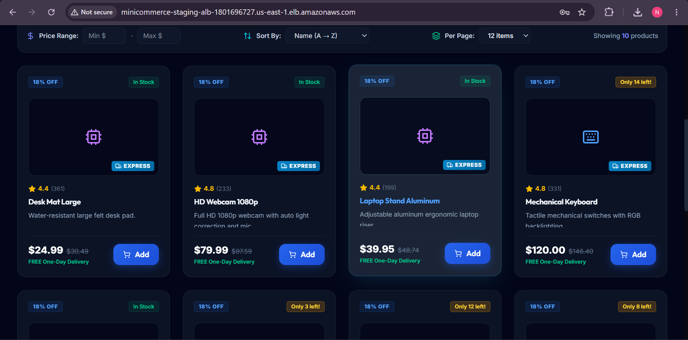 | 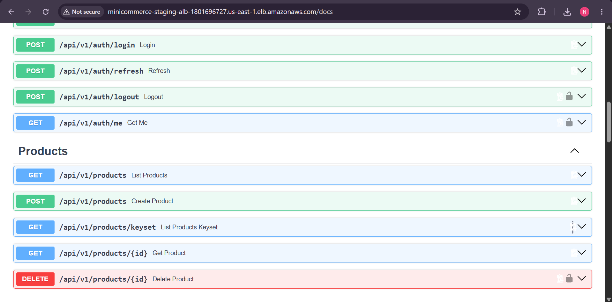 |

### Store Manager Dashboard & Admin Panel

| Store Manager Inventory Dashboard |
|:---:|
| 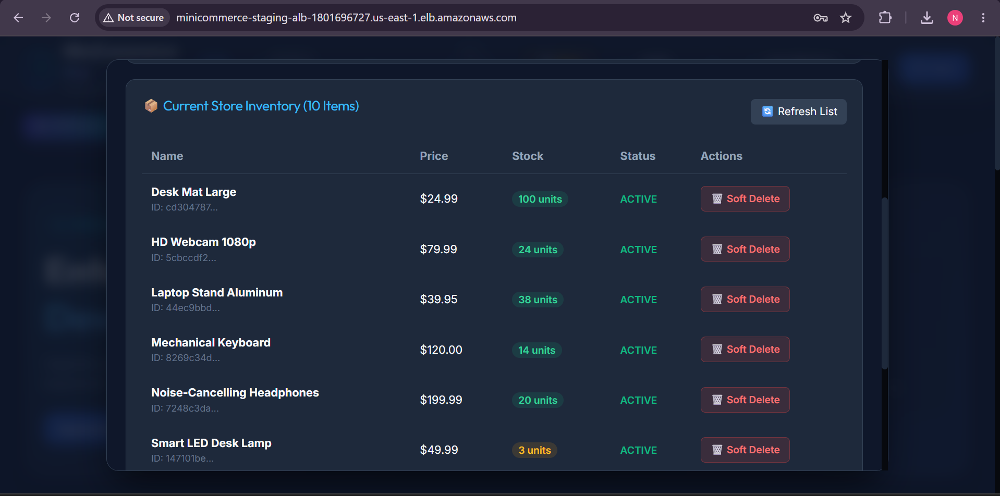 |

### AWS ECS Fargate Services

| ECS Fargate Cluster — 3 Active Services (Backend, Frontend, Worker) |
|:---:|
| 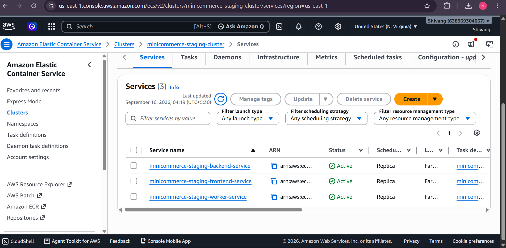 |

| ECS Backend Service Detail |
|:---:|
| 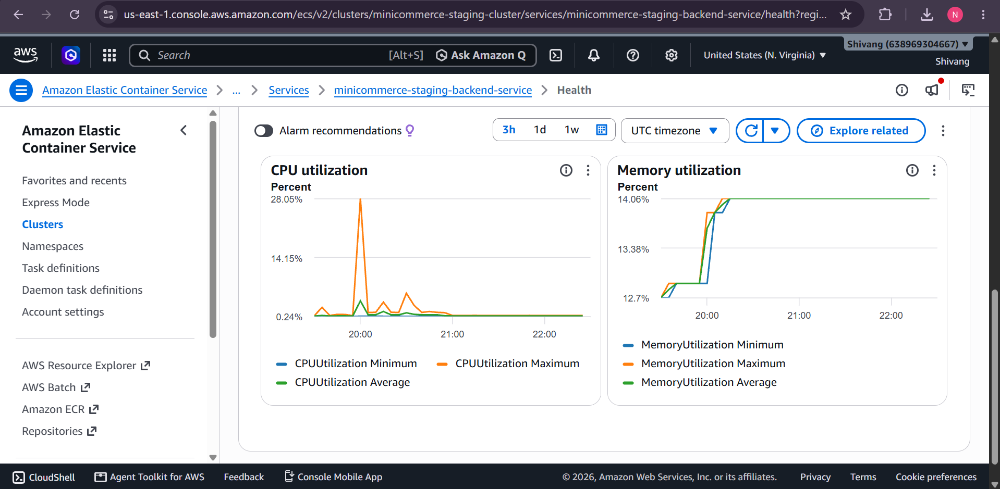 |

### AWS RDS PostgreSQL & ElastiCache Redis

| RDS PostgreSQL 15 Instance | RDS Configuration |
|:---:|:---:|
| 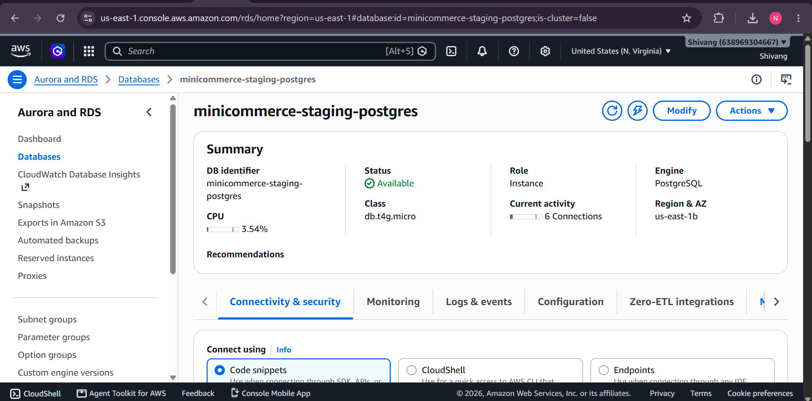 | 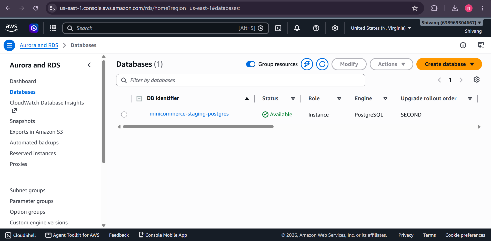 |

| ElastiCache Redis Cluster |
|:---:|
| 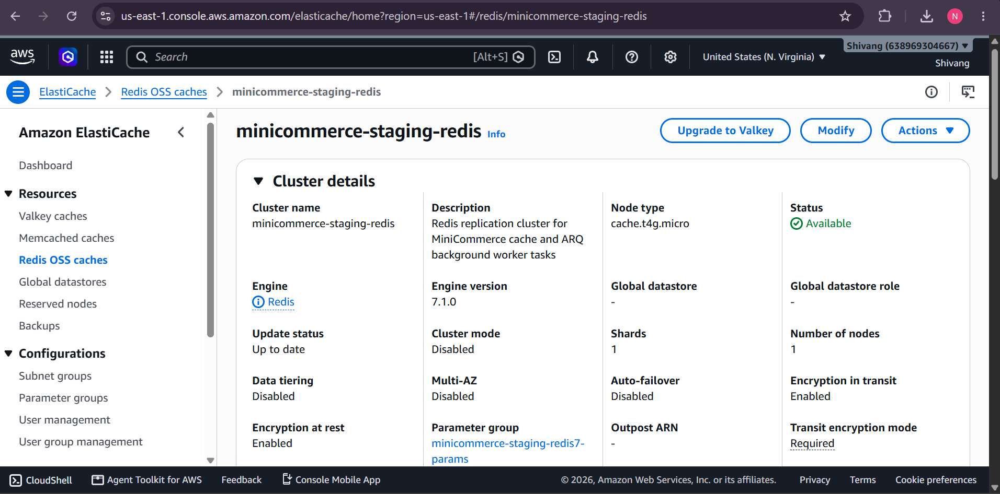 |

### AWS VPC & Networking

| VPC Dashboard | VPC Subnets across Availability Zones |
|:---:|:---:|
| 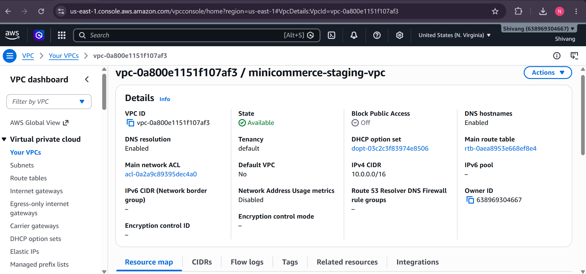 | 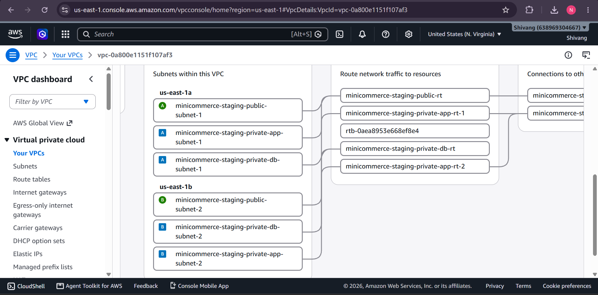 |

### AWS Application Load Balancer

| ALB Target Groups & Routing |
|:---:|
| 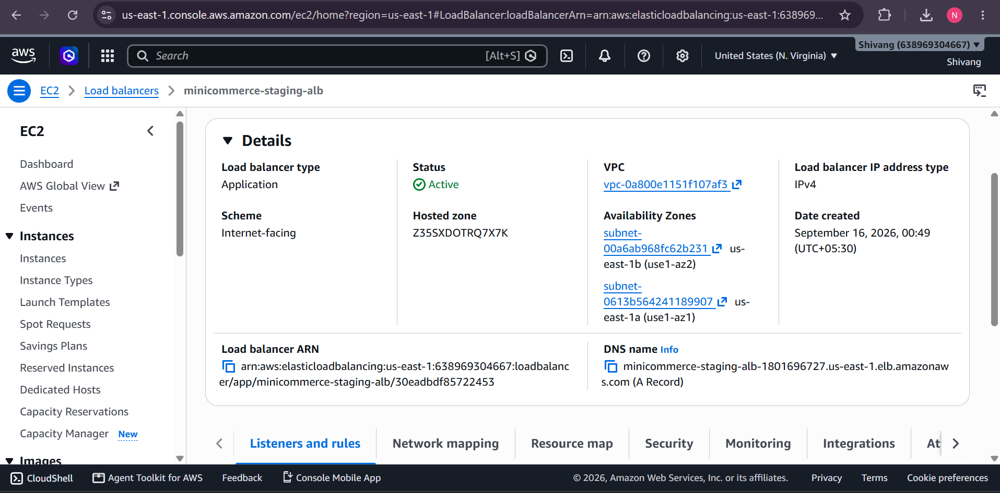 |

### CloudWatch Container Logs

| ECS CloudWatch Log Stream |
|:---:|
| 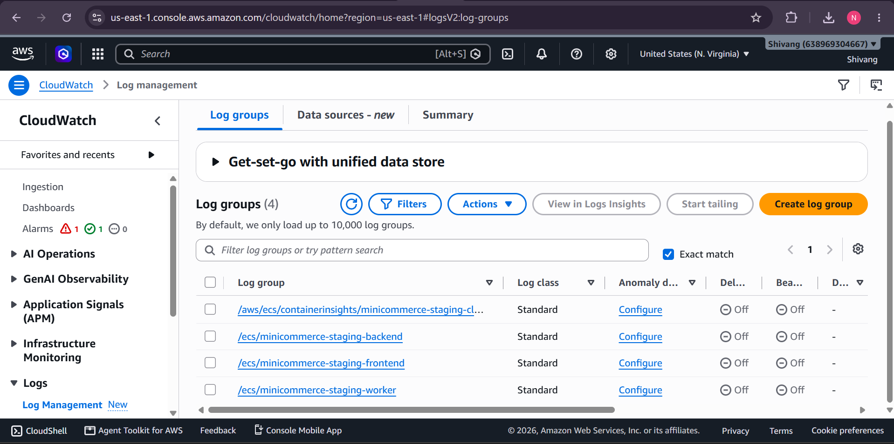 |

---

## 📝 Technical Documentation Suite

Detailed architectural specifications, experiment logs, and runbooks organized by version:

### Architecture Diagrams (Per-Version)

Each version includes **architecture diagrams** in `docs/vN/architecture_diagram/`:

| Version | Architecture Overview | Decoupled Layers | Key Sequence Diagram |
|:---:|:---:|:---:|:---:|
| **V1** | [Architecture_V1.png](docs/v1/architecture_diagram/Architecture_V1.png) | [Decoupled_Architecture_V1.png](docs/v1/architecture_diagram/Decoupled_Architecture_V1.png) | [Atomic_Transaction.png](docs/v1/architecture_diagram/Atomic_Transaction.png) |
| **V2** | [Architecture_V2.png](docs/v2/architecture_diagram/Architecture_V2.png) | [Decoupled_Architecture_V2.png](docs/v2/architecture_diagram/Decoupled_Architecture_V2.png) | [Row_level_Pessimistic_Locking.png](docs/v2/architecture_diagram/Row_level_Pessimistic_Locking.png) |
| **V3** | — | [Decoupled_Architecture_V3.png](docs/v3/architecture_diagram/Decoupled_Architecture_V3.png) | [Docker_Compose.png](docs/v3/architecture_diagram/Docker_Compose.png) / [Redis.png](docs/v3/architecture_diagram/Redis.png) |
| **V4** | [Architecture_V4.png](docs/v4/architecture_diagram/Architecture_V4.png) | [Decoupled_Architecture_V4.png](docs/v4/architecture_diagram/Decoupled_Architecture_V4.png) | [Rate_Limiting_Sequence.png](docs/v4/architecture_diagram/Rate_Limiting_Sequence.png) |
| **V5** | [Architecture_V5.png](docs/v5/architecture_diagram/Architecture_V5.png) | [Decoupled_Architecture_V5.png](docs/v5/architecture_diagram/Decoupled_Architecture_V5.png) | [Dual-Token Refresh & Outbox Sequence](docs/v5/architecture_diagram/Dual-Token%20Refresh%20%26%20Transactional%20Outbox%20Sequence.png) |
| **V6** | [Architecture_V6.png](docs/v6/architecture_diagram/Architecture_V6.png) | [Decoupled_Architecture_V6.png](docs/v6/architecture_diagram/Decoupled_Architecture_V6.png) | [Automated_Code_Quality_Gate.png](docs/v6/architecture_diagram/Automated_Code_Qhality_Gate_Execution.png) |
| **V7** | [Architecture_V7.png](docs/v7/architecture_diagram/Architecture_V7.png) | [Decoupled_Architecture_V7.png](docs/v7/architecture_diagram/Decoupled_Architecture_V7.png) | [Provisioning & Runtime Sequence](docs/v7/architecture_diagram/Provisioning%20%26%20Runtime%20Execution%20Sequence.png) / [59 AWS Services](docs/v7/architecture_diagram/59_AWS_Services.png) |
| **V8** | [Architecture_V8.png](docs/v8/architecture_diagram/Architecture_V8.png) | [Decoupled_Architecture_V8.png](docs/v8/architecture_diagram/Decoupled_Architecture_V8.png) | [OpenTelemetry & Prometheus Sequence](docs/v8/architecture_diagram/OpenTelemetry%20Context%20Propagation%20%26%20Prometheus%20Scraping%20Sequence.png) |
| **V9** | [Architecture_V9.png](docs/v9/architecture_diagram/Architecture_V9.png) | [Decoupled_Architecture_V9.png](docs/v9/architecture_diagram/Decoupled_Archtecture_V9.png) | [ReadWrite Connection Splitting Sequence](docs/v9/architecture_diagram/ReadWrite%20Connection%20Splitting%20%26%20Failover%20Sequence.png) |
| **V10** | [Architecture_V10.png](docs/v10/architecture_diagram/Architecture_V10.png) | — | [Atomic SQL UPDATE & Payload Bounding](docs/v10/architecture_diagram/Atomic%20SQL%20UPDATE%20%26%20Payload%20Bounding%20Sequence.png) |

### Specification Documents

| Version | Document | Description |
|---------|----------|-------------|
| **V2** | [architecture.md](docs/v2/architecture.md) | 5-Tier Data Layer Architecture Specification |
| **V2** | [database-design.md](docs/v2/database-design.md) | PostgreSQL Schema Design & Constraints |
| **V2** | [concurrency.md](docs/v2/concurrency.md) | Pessimistic Locking & Deadlock Prevention |
| **V2** | [idempotency.md](docs/v2/idempotency.md) | Idempotency Key Engine Design |
| **V2** | [indexing.md](docs/v2/indexing.md) | B-Tree Indexing Strategy & EXPLAIN Analysis |
| **V2** | [query-analysis.md](docs/v2/query-analysis.md) | PostgreSQL Query Plan Analysis & Benchmarks |
| **V2** | [performance.md](docs/v2/performance.md) | Performance Benchmark Results |
| **V2** | [transactions.md](docs/v2/transactions.md) | Atomic Transaction Boundaries |
| **V2** | [experiments.md](docs/v2/experiments.md) | Database Experiment Results |
| **V3** | [architecture.md](docs/v3/architecture.md) | Docker Compose & Redis Cache-Aside Architecture |
| **V3** | [performance.md](docs/v3/performance.md) | Redis Caching Performance Benchmarks |
| **V4** | [async-architecture.md](docs/v4/async-architecture.md) | ARQ Worker Pool & Async Task Architecture |
| **V4** | [benchmarks.md](docs/v4/benchmarks.md) | Synchronous vs. Async Checkout Benchmarks |
| **V4** | [rate-limiting.md](docs/v4/rate-limiting.md) | Redis ZSET Sliding-Window Rate Limiting |
| **V4** | [frontend-architecture.md](docs/v4/frontend-architecture.md) | Admin Observability Dashboard Architecture |
| **V4** | [troubleshooting.md](docs/v4/troubleshooting.md) | V4 Error Log & Resolution Tracker |
| **V5** | [security-and-rbac.md](docs/v5/security-and-rbac.md) | Zero-Trust Security, Token Rotation & Scoped RBAC |
| **V5** | [resilience-and-outbox.md](docs/v5/resilience-and-outbox.md) | Circuit Breakers, Transactional Outbox & Signal Handling |
| **V5** | [data-engineering.md](docs/v5/data-engineering.md) | Keyset Pagination, Soft Deletes & Payload Hashing |
| **V5** | [frontend-architecture.md](docs/v5/frontend-architecture.md) | Store Manager Portal & 401 Interceptor Architecture |
| **V5** | [troubleshooting.md](docs/v5/troubleshooting.md) | Comprehensive V5 Error Log & Resolution Tracker |
| **V6** | [devops-and-cicd.md](docs/v6/devops-and-cicd.md) | DevOps Automation, Pre-Commit Hooks & CI/CD Pipeline Architecture |
| **V7** | [aws-cloud-architecture.md](docs/v7/aws-cloud-architecture.md) | Infrastructure as Code & AWS Cloud Architecture Specification |
| **V7** | [v7_postmortem_and_troubleshooting.md](docs/v7/v7_postmortem_and_troubleshooting.md) | AWS Deployment Post-Mortem, Log Evidence & Troubleshooting Guide |
| **V7** | [terraform_run.txt](docs/v7/terraform_run.txt) | Live Terraform Execution & Provisioning Outputs |
| **V8** | [observability-and-sre.md](docs/v8/observability-and-sre.md) | Observability Engine, Prometheus, Grafana & SRE Runbook |
| **V9** | [chaos-and-dr.md](docs/v9/chaos-and-dr.md) | Cloud-Native High Availability, Disaster Recovery & Chaos Engineering Runbook |
| **V9** | [local-testing-and-replication.md](docs/v9/local-testing-and-replication.md) | Local Docker Testing & Benchmark Replication Guide |

---

## 📁 Version Work Logs (`v/` Directory)

The `v/` directory contains **per-version master specification & work logs** documenting the step-by-step implementation process, error resolution tracker, architecture decisions, key code snippets, and verification commands for each version:

| File | Version | Description |
|------|---------|-------------|
| [v1.txt](v/v1.txt) | V1 | Foundation & API Architecture — FastAPI, SQLAlchemy, JWT, Atomic Checkout |
| [v2.txt](v/v2.txt) | V2 | Database Engineering — B-Tree Indexing, Pessimistic Locking, Idempotency, 409K Records |
| [v3.txt](v/v3.txt) | V3 | Containerization & Caching — Docker Compose, Redis Cache-Aside, Write Invalidation |
| [v4.txt](v/v4.txt) | V4 | Async Task Queue — ARQ Worker, Sliding-Window Rate Limiter, Admin Dashboard |
| [v5.txt](v/v5.txt) | V5 | Enterprise Security — Dual JWT, RBAC, Circuit Breaker, Outbox, Keyset Pagination |
| [v6.txt](v/v6.txt) | V6 | DevOps & CI/CD — Pre-Commit Hooks, GitHub Actions CI/CD, Docker GHCR Delivery |
| [v7.txt](v/v7.txt) | V7 | AWS Cloud IaC — Terraform, VPC, ECS Fargate, RDS, ElastiCache, ALB, Secrets Manager |
| [v8.txt](v/v8.txt) | V8 | Observability & SRE — Prometheus, Grafana, Alertmanager, OpenTelemetry, Jaeger, AMP/AMG |
| [v9.txt](v/v9.txt) | V9 | High Availability & Chaos — Read Replicas, Locust Load Testing, WAF, DR Runbook |
| [v10.txt](v/v10.txt) | V10 | Production Readiness — Multi-Stage Docker, Alembic Migrations, Atomic SQL, CORS, CI PostgreSQL |
