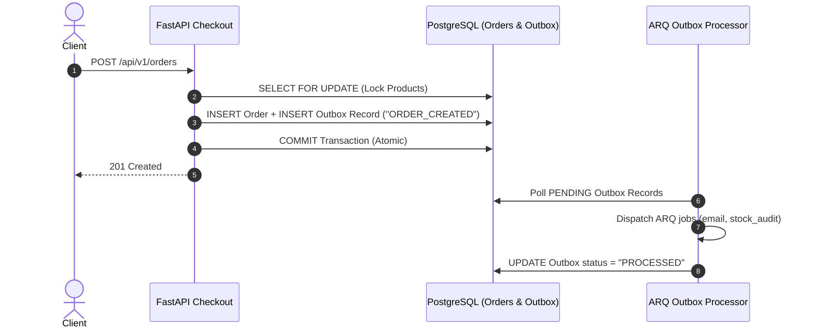

# ⚡ MiniCommerce V5 Documentation — Distributed Resilience & Transactional Outbox Pattern

Version 5 guarantees system availability, fault tolerance, and zero event loss through Circuit Breaker state machines, Transactional Outbox event processing, and Graceful Signal Handling.

---

## ⚡ 1. Thread-Safe Circuit Breaker Pattern (`app/core/circuit_breaker.py`)

Downstream dependencies (database connections, Redis datastore) are isolated by a thread-safe **Circuit Breaker**:

```text
    +-------------------------------------------------------------------------+
    |                               CLOSED (Normal)                           |
    |  Executes queries & tracks failure rate over a 10s sliding window       |
    +------------------------------------+------------------------------------+
                                         |
                                         | Failure rate >= 50%
                                         v
    +-------------------------------------------------------------------------+
    |                                 OPEN                                    |
    |  Rejects requests immediately with CircuitBreakerOpenException (15s)   |
    +------------------------------------+------------------------------------+
                                         |
                                         | 15s recovery timer expires
                                         v
    +-------------------------------------------------------------------------+
    |                               HALF-OPEN                                 |
    |  Allows 1 trial request to probe downstream store recovery status       |
    +------------------------------------+------------------------------------+
                   |                                       |
                   | Failure                               | Success
                   v                                       v
                 OPEN                                    CLOSED
```

### Key Parameters:
- **Failure Threshold**: 50% error rate over a 10-second window.
- **Recovery Time**: 15 seconds in `OPEN` state before probing in `HALF-OPEN`.
- **Min Requests**: 5 requests evaluated before state transition triggers.

---

## 📦 2. Transactional Outbox Pattern (100% Guaranteed Event Delivery)

To prevent dual-write inconsistencies between PostgreSQL and Redis ARQ queues, MiniCommerce V5 implements the **Transactional Outbox Pattern**:



### Outbox Table Schema (`app/models/outbox.py`):
- `id`: UUID Primary Key
- `event_type`: String (e.g. `"ORDER_CREATED"`)
- `payload_json`: JSON text containing order details, items, stock, and user email
- `status`: String (`"PENDING"`, `"PROCESSED"`)
- `created_at`: Timestamp with timezone
- `processed_at`: Timestamp with timezone

---

## 🛑 3. Graceful Shutdown & Signal Handling (`SIGTERM`/`SIGINT`)

FastAPI lifespan context (`app/main.py`) intercepts process termination signals to ensure active transactions finish cleanly before Uvicorn exits:

```python
@asynccontextmanager
async def lifespan(app: FastAPI):
    ...
    yield
    logger.info("Initiating graceful shutdown sequence: draining connection pools...")
    await close_redis_pool()
    await engine.dispose()
    logger.info("Graceful shutdown complete.")
```
